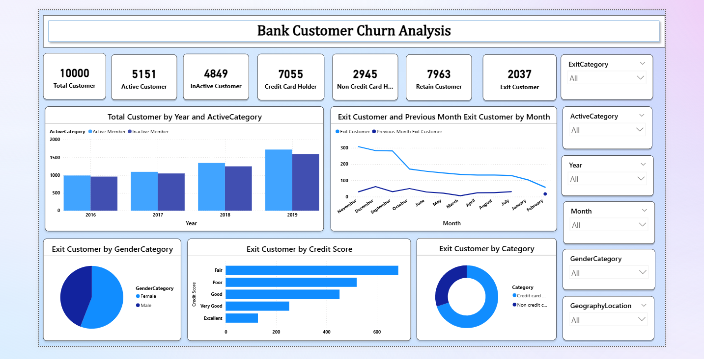
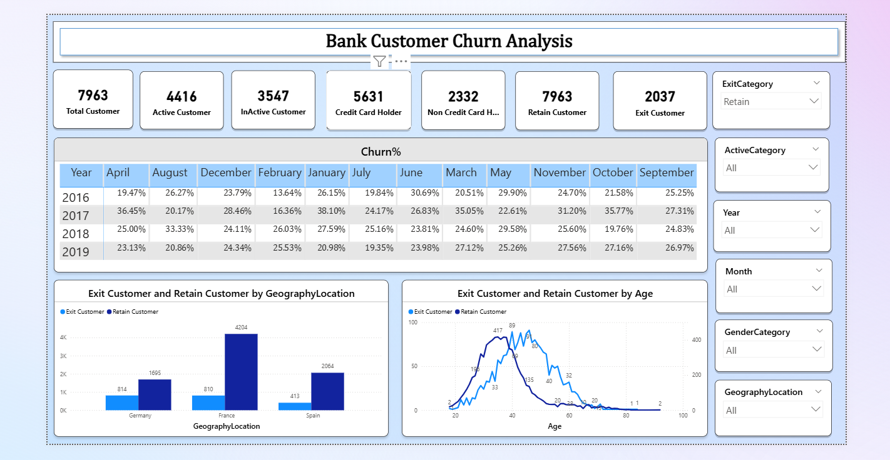

# 📊 Bank Customer Churn Analysis Dashboard

## 📌 Project Overview
This project analyzes customer churn data to identify patterns and factors affecting customer retention.

## 🛠 Tools Used
- Power BI  
- Data Visualization  
- Data Analysis  

## 📊 Key Insights
- Customers with lower credit scores have higher churn rates  
- Mid-age customers show higher churn probability  
- Certain regions have more churn compared to others  

## 📸 Dashboard Preview
### 🔹 Dashboard 1

### 🔹 Dashboard 2

## 📁 Files
- Power BI File (.pbix)
- Dashboard Screenshot
